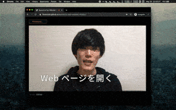

# Webカメラの映像に自動字幕を重ねるWebページ

Web Speech API の音声認識を利用して文字起こしした結果をWebカメラ映像に重畳して表示するWebページです。ブラウザを画面収録して，ビデオ会議や生配信等で使用できます。

# デモページ
https://1heisuzuki.github.io/speech-to-text-webcam-overlay/  
*PC版のGoogle Chromeでアクセスしてください。

# 動作環境
- PC版 Google Chrome
  - 最新のWindows, macOSでなんとなく確認済
  - 詳しい動作検証はしていないのでご了承ください :pray:

# よくある質問
## 使用環境関係
### iPhoneやiPadのChromeで使えない
- iOS (iPhoneやiPad)のChromeは，中身がSafariのWebKitで実装されているため，音声認識に利用している Web Speech API が現段階では利用できません。PC版のChromeでアクセスしてください。  
参考: https://news.mynavi.jp/article/20190331-iphone_why/

### カメラやマイクが認識されない
- ページを再読み込みするか，ブラウザの設定を確認してください。  
参考: https://support.google.com/chrome/answer/2693767?co=GENIE.Platform%3DDesktop&hl=ja&oco=1

## 機能について
### 相手側の音声を表示したい
- マイクに相手側の声が物理的に入るようにする（ハウリング注意），PC内部で直接相手の音をブラウザに流し込むなどの方法があります。    
参考: https://www.cg-method.com/entry/google-document-convert-voice-to-text/  
参考: https://ghosthack.net/?p=5680

### 文字の修正をしたい
- 認識結果のログでは修正可能になっています。合成画面上での編集については未実装です。
- Google Docsなどの音声入力やUDトークなど，他のツールの利用で要望を満たせるかもしれません。  
参考: Google Docs ヘルプ / 音声で入力する https://support.google.com/docs/answer/4492226?hl=ja

### 文字認識の結果を保存したい
- 実装しました。
- 保存を自動的に行いたい場合は，Google Docsなどの音声入力やUDトークなど，他のツールの利用を検討してください。  
参考: Google Docs ヘルプ / 音声で入力する https://support.google.com/docs/answer/4492226?hl=ja  

### 自動で翻訳したい
- 現状実装されていません。
- Google Apps ScriptのClass LanguageAppや，Google Cloud Translateなどを利用すれば実装できます。リクエスト数の制限があったり課金制だったりするので注意してください。  
参考: https://developers.google.com/apps-script/reference/language/language-app  
参考: https://cloud.google.com/translate

### 他の言語を認識したい
- 現状実装されていません（日本語固定設定）。
- Googleが公開しているWeb Speech APIのサンプルページでは言語を切り替えて利用できません  
参考: https://www.google.com/intl/en/chrome/demos/speech.html

## その他
### ブログや生配信で紹介したい
- オープンに公開しているので，自由に使ってください！

# 関連資料
- リモートミーティングでの音声認識の活用事例  
https://github.com/DigitalNatureGroup/Remote_Voice_Recognition

# 参考資料
コードを書くにあたって参考にしたWebページ等
- HTML5のWebRTCでPCに接続されたカメラ映像をウェブブラウザー上に表示してコマ画像を保存したい  
https://qiita.com/qiita_mona/items/e58943cf74c40678050a
- Web Speech APIで途切れない音声認識  
https://jellyware.jp/kurage/iot/webspeechapi.html
- 使用してるブラウザを判定したい  
https://qiita.com/sakuraya/items/33f93e19438d0694a91d